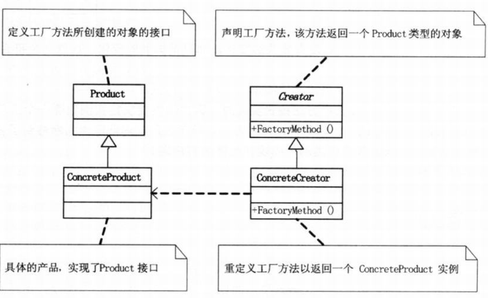

# 23中设计模式(java实现)
## 一、策略模式
**定义：封装算法族，算法之间可以相互替换，算法的变化不会影响使用算法客户。**  


```
package com.sosop.design.pattern.strategy;

interface DBStrategy {
    public void db();
}

class MysqlStrategy implements DBStrategy {

    @Override
    public void db() {
        System.out.println("use mysql");
    }
}

class OracleStartegy implements DBStrategy {

    @Override
    public void db() {
        System.out.println("use oracle");
    }
}

class PostgreSql implements DBStrategy {

    @Override
    public void db() {
        System.out.println("use postgresql");
    }
}

class Context {
    private DBStrategy strategy;

    public Context() {}
    
    public Context(DBStrategy strategy) {
        this.strategy = strategy;
    }
    
    public void setStrategy(DBStrategy strategy) {
        this.strategy = strategy;
    }
    
    public void useDB() {
        strategy.db();
    }
}

package com.sosop.design.pattern.strategy;

public class Main {
    public static void main(String[] args) {
        Context context = new Context(new PostgreSql());
        context.useDB();
        context.setStrategy(new MysqlStrategy());
        context.useDB();
    }
}
```

## 二、装饰者模式
**定义：动态得给一个对象添加额外得职责。**


```
package com.sosop.design.pattern.decorate;

public interface ClothComponent {
    void clothe ();
}

package com.sosop.design.pattern.decorate;

public class Person implements ClothComponent {

    private ClothComponent cloth;
    
    public Person(ClothComponent cloth) {
        this.cloth = cloth;
    }
    
    public ClothComponent getCloth() {
        return cloth;
    }

    public void setCloth(ClothComponent cloth) {
        this.cloth = cloth;
    }

    @Override
    public void clothe() {
        cloth.clothe();
        System.out.println("穿衣完成");
    }
}

class Decorator implements ClothComponent {
    
    protected ClothComponent cloth;
    
    public Decorator() {}
    
    public Decorator(ClothComponent cloth) {
        this.cloth = cloth;
    }
    
    public ClothComponent getCloth() {
        return cloth;
    }

    public void setCloth(ClothComponent cloth) {
        this.cloth = cloth;
    }

    @Override
    public void clothe() {
        if (null != cloth) {
            cloth.clothe();
        }
    }
    
}

class Undies extends Decorator {
    
    public Undies() {}
    
    public Undies(Decorator d) {
        super(d);
    }
    
    @Override
    public void clothe() {
        super.clothe();
        System.out.println("穿内衣");
    }
}
class Sweater extends Decorator {
    
    public Sweater(){}
    
    public Sweater(ClothComponent cloth) {
        super(cloth);
    }

    @Override
    public void clothe() {
        super.clothe();
        System.out.println("穿毛衣");
    }
}
class Coat extends Decorator {
    
    public Coat(){}
    
    public Coat(ClothComponent cloth) {
        super(cloth);
    }

    @Override
    public void clothe() {
        super.clothe();
        System.out.println("穿外套");
    }
    
    
}
package com.sosop.design.pattern.decorate;

public class Main {
    public static void main(String[] args) {
        // 一个人的穿衣顺序先穿内衣，再穿毛衣，再穿外套
        Decorator undies = new Undies();
        Decorator sweater = new Sweater(undies);
        Decorator coat = new Coat(sweater);
        
        Person p = new Person(coat);
        
        p.clothe();
    }
}
```

## 三、代理
**定义：为其他对象提供一种代理以控制对这个对象的访问。**  

*代理模式的应用：1、远程代理；2、虚拟代理；3、安全代理*

```
package com.sosop.design.pattern.proxy;

public interface Person {
    void op();
}

class Principal implements Person {
    
    @Override
    public void op() {
        System.out.println("我要打官司");
    }
}

class Layer implements Person {

    private Principal p;
    
    public Layer(Principal p) {
        this.p = p;
    }
    
    @Override
    public void op() {
        p.op();
    }
}
package com.sosop.design.pattern.proxy;

public class Main {

    public static void main(String[] args) {
        Principal p = new Principal();
        Layer layer = new Layer(p);
        layer.op();
    }

}
```

## 四、工程方法
**定义：定义了创建对象的接口，由子类决定实例化某个类。**


```
package com.sosop.design.pattern.factory.method;

interface CarFactory {
    Car createCar();
}

class MaseratiFactory implements CarFactory {
    @Override
    public Car createCar() {
        return new Maserati();
    }
}

class LamborghiniFactory implements CarFactory {

    @Override
    public Car createCar() {
        return new Lamborghini();
    }
}

interface Car {
    void showName();
}

class Maserati implements Car {

    @Override
    public void showName() {
        System.out.println("玛莎拉蒂");
    }
}

class Lamborghini implements Car {

    @Override
    public void showName() {
        System.out.println("兰博基尼");
    }
}

public class Main {
    public static void main(String[] args) {
        CarFactory mfactory = new MaseratiFactory();
        mfactory.createCar().showName();
        CarFactory lfactory = new LamborghiniFactory();
        lfactory.createCar().showName();
    }
}
```


